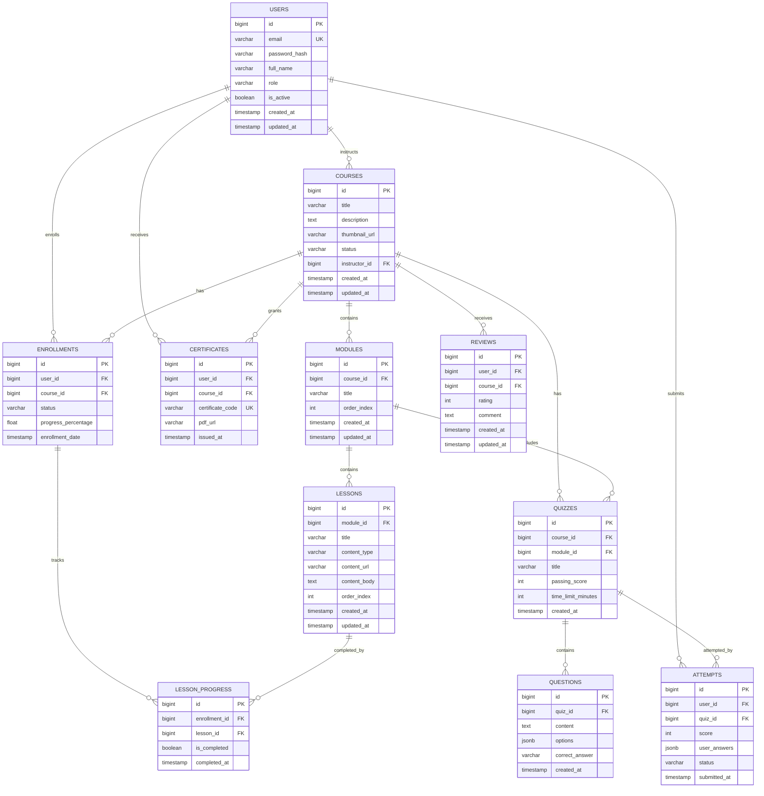

# LMS Database ERD

```mermaid
erDiagram
    USERS ||--o{ COURSES : instructs
    USERS ||--o{ ENROLLMENTS : enrolls
    USERS ||--o{ ATTEMPTS : submits
    USERS ||--o{ CERTIFICATES : receives

    COURSES ||--o{ MODULES : contains
    COURSES ||--o{ ENROLLMENTS : has
    COURSES ||--o{ QUIZZES : has
    COURSES ||--o{ CERTIFICATES : grants
    COURSES ||--o{ REVIEWS : receives

    MODULES ||--o{ LESSONS : contains
    MODULES ||--o{ QUIZZES : includes

    ENROLLMENTS ||--o{ LESSON_PROGRESS : tracks
    LESSONS ||--o{ LESSON_PROGRESS : completed_by

    QUIZZES ||--o{ QUESTIONS : contains
    QUIZZES ||--o{ ATTEMPTS : attempted_by

    USERS {
        bigint id PK
        varchar email UK
        varchar password_hash
        varchar full_name
        varchar role
        boolean is_active
        timestamp created_at
        timestamp updated_at
    }

    COURSES {
        bigint id PK
        varchar title
        text description
        varchar thumbnail_url
        varchar status
        bigint instructor_id FK
        timestamp created_at
        timestamp updated_at
    }

    MODULES {
        bigint id PK
        bigint course_id FK
        varchar title
        int order_index
        timestamp created_at
        timestamp updated_at
    }

    LESSONS {
        bigint id PK
        bigint module_id FK
        varchar title
        varchar content_type
        varchar content_url
        text content_body
        int order_index
        timestamp created_at
        timestamp updated_at
    }

    ENROLLMENTS {
        bigint id PK
        bigint user_id FK
        bigint course_id FK
        varchar status
        float progress_percentage
        timestamp enrollment_date
    }

    LESSON_PROGRESS {
        bigint id PK
        bigint enrollment_id FK
        bigint lesson_id FK
        boolean is_completed
        timestamp completed_at
    }

    QUIZZES {
        bigint id PK
        bigint course_id FK
        bigint module_id FK
        varchar title
        int passing_score
        int time_limit_minutes
        timestamp created_at
    }

    QUESTIONS {
        bigint id PK
        bigint quiz_id FK
        text content
        jsonb options
        varchar correct_answer
        timestamp created_at
    }

    ATTEMPTS {
        bigint id PK
        bigint user_id FK
        bigint quiz_id FK
        int score
        jsonb user_answers
        varchar status
        timestamp submitted_at
    }

    CERTIFICATES {
        bigint id PK
        bigint user_id FK
        bigint course_id FK
        varchar certificate_code UK
        varchar pdf_url
        timestamp issued_at
    }

    REVIEWS {
        bigint id PK
        bigint user_id FK
        bigint course_id FK
        int rating
        text comment
        timestamp created_at
        timestamp updated_at
    }
```
